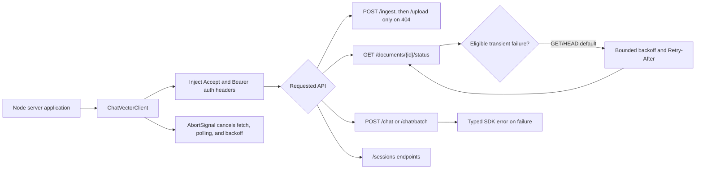
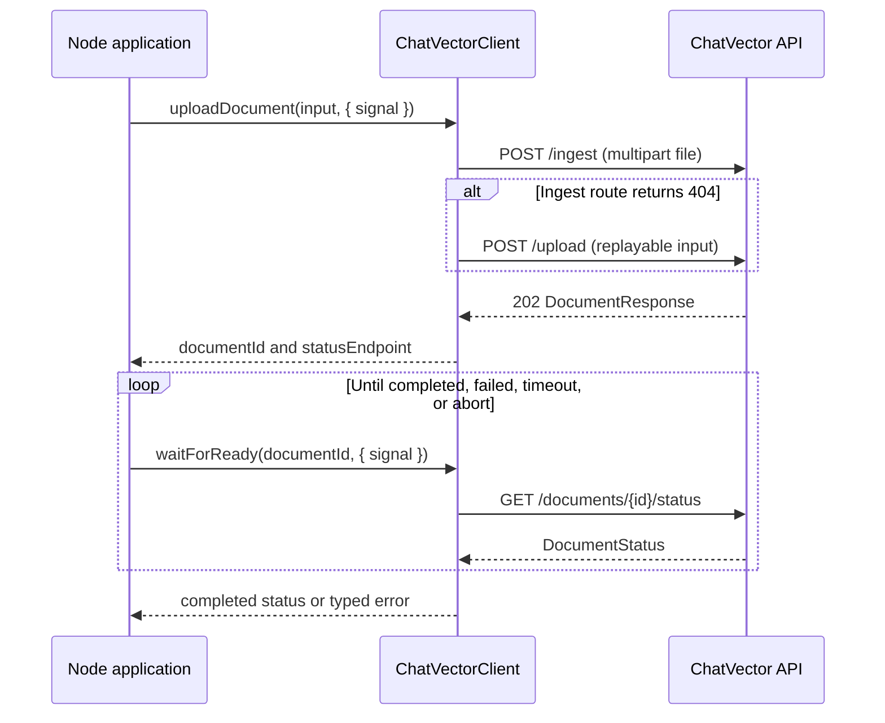

# Proposal: Node-first TypeScript SDK v0

**Status:** proposed
**Scope:** server-side Node.js SDK only; implementation intentionally deferred

## Decision summary

| Area | Decision |
| --- | --- |
| npm package | `@chatvector/sdk`, published publicly to npm |
| Repository location | `sdk/typescript/` |
| Runtime | Node.js 22 and 24 LTS; `engines.node: ">=22"` |
| Module formats | ESM-first package with supported CJS entry point |
| HTTP stack | Native Node `fetch`, `FormData`, `Blob`, `fs.openAsBlob`, and `AbortController`; no runtime dependencies |
| v0 features | Upload/ingest compatibility, status polling, `waitForReady`, non-streaming chat, batch chat, sessions, cancellation, typed errors, and retry controls |
| Deferred | Chat SSE, document-status SSE, browsers, React, edge/browser runtimes, logging, and pagination |

The package name requires control of the `@chatvector` npm organization before
release. Publish with public access and npm provenance. Do not fall back to an
unscoped `chatvector` package without a separate maintainer decision.

## Goals

Give backend Node developers one typed client for the already-shipped document
ingestion, chat, batch, and session APIs. The API should be familiar to users
of the Python `ChatVectorClient`, while using TypeScript's camelCase naming at
the public boundary and converting to the backend's snake_case JSON on the
wire.

The SDK must keep API keys on the server. An application owns authentication
for its own users; the SDK owns only ChatVector bearer authentication.

## Package layout

```text
sdk/
  python/                         # existing SDK
  typescript/
    DESIGN.md                     # this approved design
    package.json                  # name: @chatvector/sdk
    README.md
    LICENSE                       # repository MIT license reference/copy
    tsconfig.json
    tsconfig.build.json
    tsup.config.ts
    vitest.config.ts
    src/
      index.ts                    # only supported public exports
      client.ts                    # flat ChatVectorClient facade and public options
      models.ts                    # request/response TypeScript types
      errors.ts                    # exported error hierarchy
      resources/
        documents.ts               # internal document endpoint ownership
        chats.ts                   # internal chat endpoint ownership
        sessions.ts                # internal session endpoint ownership
      internal/
        http.ts                    # auth, serialization, error decoding
        retry.ts                   # retry decision and backoff calculation
        upload.ts                  # Node path/blob/bytes multipart adapter
        time.ts                    # injectable clock/sleep for tests
        sse.ts                     # added in rollout phase 2, not v0
      browser-stub.ts              # intentional server-only error entry, not a browser SDK
    tests/
      unit/
        client.test.ts
        errors.test.ts
        retry.test.ts
        upload.test.ts
        sessions.test.ts
      fixtures/                    # captured, sanitized API payloads
      integration/
        live-api.test.ts           # opt-in, never runs by default
      package-exports.test.ts      # ESM and CJS consumer smoke tests
    examples/
      fastify-proxy/
        package.json
        src/server.ts
        README.md
```

`src/index.ts` is the public-export boundary. The public API remains a flat
facade, but it delegates to the resource modules above so the implementation
does not become a god object. Future plural namespaces (`client.documents`,
`client.chats`, `client.sessions`) may be introduced additively; flat methods
remain compatible. `internal/` is not exported and may change without a semver
guarantee. The first scaffold must not add the phase-2 `sse.ts`
implementation; the placeholder only reserves the ownership boundary.

## Runtime and packaging

| Runtime | v0 support | Notes |
| --- | --- | --- |
| Node.js 22 LTS | supported and CI-tested | minimum supported runtime |
| Node.js 24 LTS | supported and CI-tested | current preferred LTS |
| Node.js 26 Current | best effort only | not a support commitment until LTS |
| Node 20 and earlier | unsupported | Node 20 is end-of-life |
| Browser, React, React Native, Workers, Deno, Bun | unsupported | deliberately deferred |

The package compiles to ES2022 and ships declarations. It is ESM-first, but
provides a CJS `require` condition so common Node backends can adopt it without
changing their module system immediately:

```json
{
  "type": "module",
  "engines": { "node": ">=22" },
  "exports": {
    ".": {
      "browser": "./dist/browser-stub.js",
      "types": "./dist/index.d.ts",
      "import": "./dist/index.js",
      "require": "./dist/index.cjs"
    }
  }
}
```

Use `tsup` for the dual build and `tsc --noEmit` for type checking. Native
Node web APIs avoid a runtime HTTP dependency and make the supported platform
explicit. Do not advertise this as isomorphic: the upload adapter uses Node
filesystem APIs. Node-only imports must not be static root-entry dependencies.
The browser export is an intentional stub that raises a clear server-only
usage error; it is a safety guard, not browser support.

## Client and API surface

```ts
import { ChatVectorClient } from "@chatvector/sdk";

const client = new ChatVectorClient({
  baseUrl: process.env.CHATVECTOR_BASE_URL!,
  apiKey: process.env.CHATVECTOR_API_KEY!,
  timeoutMs: 30_000,
});
```

Constructor options:

```ts
type ChatVectorClientOptions = {
  baseUrl: string;
  apiKey?: string;
  timeoutMs?: number;              // default: 30_000
  retry?: RetryOptions | false;
  fetch?: typeof globalThis.fetch; // dependency injection for tests/advanced Node use
};

type RequestOptions = {
  signal?: AbortSignal;
};
```

Every request sends `Accept: application/json`; when `apiKey` is set it also
sends `Authorization: Bearer <apiKey>`. The key is never included in errors,
logs, response models, or query strings.

The public method names are intentionally close to Python, but inputs and
responses are camelCase:

```ts
class ChatVectorClient {
  uploadDocument(input: UploadInput, options?: RequestOptions): Promise<DocumentResponse>;
  getDocumentStatus(documentId: string, options?: RequestOptions): Promise<DocumentStatus>;
  waitForReady(documentId: string, options?: WaitForReadyOptions): Promise<DocumentStatus>;

  chat(request: ChatRequest, options?: RequestOptions): Promise<ChatResponse>;
  batchChat(request: BatchChatRequest, options?: RequestOptions): Promise<BatchChatResponse>;

  createSession(input?: CreateSessionInput, options?: RequestOptions): Promise<Session>;
  getSession(sessionId: string, options?: RequestOptions): Promise<Session>;
  listSessions(options?: RequestOptions): Promise<SessionListResponse>;
  deleteSession(sessionId: string, options?: RequestOptions): Promise<void>;
}
```

### Endpoint mapping

| Public method | HTTP request | Notes |
| --- | --- | --- |
| `uploadDocument` | `POST /ingest`, then `POST /upload` only on `404` | matches Python compatibility behavior; multipart field name is `file` |
| `getDocumentStatus` | `GET /documents/{documentId}/status` | returns live queue position while queued |
| `waitForReady` | repeated document-status calls | terminal `completed` returns; terminal `failed` throws |
| `chat` | `POST /chat` | supports a document, session, match count, and retrieval scope |
| `batchChat` | `POST /chat/batch` | supports batch- and item-level sessions/scopes |
| `listSessions` | `GET /sessions` | direct, unpaginated backend response; no SDK pagination |
| other session methods | `/sessions` and `/sessions/{sessionId}` | create, get, delete |

### Request lifecycle





`uploadDocument` accepts a path or replayable in-memory content:

```ts
type UploadInput =
  | { path: string; contentType?: string }
  | { data: Uint8Array | Blob; fileName: string; contentType?: string };
```

Paths use Node's `openAsBlob` and are re-opened for the `/ingest` to `/upload`
compatibility fallback; bytes and blobs are reusable. v0 deliberately does not
accept a one-shot `Readable` because a failed compatibility fallback or retry
cannot replay it reliably. A stream-oriented upload API or HTTP dependency is
deferred until a separate performance-focused design establishes the need.

Every network-facing public method accepts `RequestOptions.signal`. This lets a
Fastify, Express, or other server cancel upstream work when its downstream
request is aborted. `waitForReady` preserves Python's defaults of
`timeoutMs: 60_000` and `pollIntervalMs: 2_000`; its signal cancels an active
fetch, polling sleep, and retry backoff without beginning another request or
upload fallback. An external cancellation retains the platform `AbortError`.
Invalid non-positive values fail before making a request. A `failed` document
raises `ChatVectorAPIError` with `code: "document_failed"` and the final
`DocumentStatus` in `details`; a deadline expiry raises `ChatVectorTimeoutError`.

### Request and response models

The SDK serializes camelCase input to the currently deployed snake_case
backend contract. It does not validate user text or UUIDs client-side beyond
basic required-field checks; backend validation remains authoritative.

```ts
type RetrievalScope = "session" | "tenant";

type ChatRequest = {
  question: string;
  docId: string;
  matchCount?: number; // backend default 5, valid range 1..20
  sessionId?: string;
  scope?: RetrievalScope; // backend default "session"
};

type BatchChatQuery = {
  question: string;
  docIds: string[];
  matchCount?: number;
  sessionId?: string;
  scope?: RetrievalScope;
};

type BatchChatRequest = {
  queries: BatchChatQuery[];
  sessionId?: string;
  scope?: RetrievalScope;
};

type ChatSource = {
  fileName: string | null;
  pageNumber: number | null;
  chunkIndex: number | null;
  score?: number | null;
  scoreType?: string | null; // currently vector, hybrid_rrf, or reranked
};

type DocumentResponse = {
  documentId: string;
  status: string;
  message?: string;
  queuePosition?: number;
  statusEndpoint?: string;
};

type DocumentStatus = {
  documentId: string;
  status: string;
  chunks?: Record<string, unknown> | null;
  createdAt?: string | null;
  updatedAt?: string | null;
  error?: Record<string, unknown> | null;
  queuePosition?: number;
};

type ChatResponse = {
  question: string;
  docId: string;
  chunks: number;
  answer: string;
  sources: ChatSource[];
  latencyMs: number;
  model: string;
  status: "ok" | "error";
  error?: { code: string; message: string };
};

type BatchChatResult = {
  status: "ok" | "error";
  question: string;
  docIds: string[];
  chunks: number;
  answer?: string;
  sources?: ChatSource[];
  error?: { code: string; message: string };
  latencyMs: number;
  model: string;
};

type BatchChatResponse = {
  count: number;
  successCount: number;
  failureCount: number;
  results: BatchChatResult[];
};

type Session = {
  id: string;
  tenantId: string | null;
  createdAt: string;
  lastActive: string;
  metadata: Record<string, unknown>;
  documentIds: string[];
};

type SessionListResponse = { sessions: Session[] };
type CreateSessionInput = { sessionId?: string };
type WaitForReadyOptions = RequestOptions & {
  timeoutMs?: number;
  pollIntervalMs?: number;
};
```

`chat()` may omit `sessionId`, which preserves the backend's automatic session
creation. The non-streaming `/chat` response does **not** currently return
that generated ID, so an application that needs a continued conversation must
call `createSession()` first and pass `sessionId` explicitly. v0 must not
invent a session ID that the backend did not return.

Chat and batch can return a successful HTTP response with `status: "error"`
for provider/retrieval soft failures. That is represented in `ChatResponse`
and `BatchChatResult`, rather than incorrectly converting it to an HTTP error.

`listSessions()` intentionally returns the backend's current unbounded
`SessionListResponse` unchanged. `GET /sessions` accepts no `limit`, `cursor`,
or `page` arguments today, so v0 adds neither pagination parameters nor an
auto-pagination abstraction. Pagination is a future backend-contract change,
not an SDK workaround.

## Error model

Export the same conceptual hierarchy as the Python SDK:

```ts
type ChatVectorErrorKind = "api" | "auth" | "rate_limit" | "timeout";

class ChatVectorAPIError extends Error {
  readonly kind: ChatVectorErrorKind = "api";
  readonly statusCode?: number;
  readonly code?: string;
  readonly details?: unknown;
  override readonly cause?: unknown;
}

class ChatVectorAuthError extends ChatVectorAPIError {
  override readonly kind = "auth";
}
class ChatVectorRateLimitError extends ChatVectorAPIError {
  override readonly kind = "rate_limit";
  readonly retryAfterMs?: number;
}
class ChatVectorTimeoutError extends ChatVectorAPIError {
  override readonly kind = "timeout";
}

function isChatVectorError(error: unknown): error is ChatVectorAPIError;
```

| Condition | Error |
| --- | --- |
| HTTP 401 or 403 | `ChatVectorAuthError` |
| HTTP 429 | `ChatVectorRateLimitError` |
| HTTP 408, 504, request timeout, or connection failure | `ChatVectorTimeoutError` |
| other non-2xx response, malformed JSON, or unexpected transport failure | `ChatVectorAPIError` |
| `waitForReady` observes `failed` | `ChatVectorAPIError` with `code: "document_failed"` |

Decode both FastAPI shapes used in the repository: `{ detail: { code, message,
... } }` and `{ detail: "..." }`. Preserve the decoded body in `details` and
use the backend code, if available. Never include the bearer token in a
message, `details`, or `cause` serialization.

`instanceof` remains convenient, but is not the sole cross-package contract:
the stable `kind` discriminator and `isChatVectorError()` type guard support
applications that load duplicate ESM/CJS package instances.

Caller cancellation is not reclassified: an externally aborted signal retains
the platform's `AbortError`. SDK-created timeouts become
`ChatVectorTimeoutError` so callers can handle an intentional deadline
consistently.

## Retry and backoff

Default retry behavior is deliberately safer than blindly replaying every
Python request. The current backend has no idempotency key contract, while
`POST /upload`, `/chat`, `/chat/batch`, and `/sessions` can create documents,
sessions, or persisted messages. Retrying an ambiguous POST could duplicate
that work.

```ts
type RetryOptions = {
  maxRetries?: number;       // default 2: at most 3 total attempts
  initialDelayMs?: number;   // default 500
  maxDelayMs?: number;       // default 8_000
};
```

* Automatically retry only `GET` and `HEAD` requests, including the polling
  done by `waitForReady`.
* Retry only connection/timeouts and HTTP `408`, `429`, `502`, `503`, and
  `504`. Do not retry authentication, validation, other 4xx, generic 500, or
  a parsed application-level `status: "error"` result.
* Backoff is bounded exponential full jitter: for retry number `n` (starting
  at zero), use a random delay from `0..min(initialDelayMs * 2^n, maxDelayMs)`.
  If `Retry-After` is valid, sleep at least that long.
* Parse `Retry-After` as either delta seconds or an HTTP date. Invalid or
  expired values are ignored. Expose the resulting value on the final
  `ChatVectorRateLimitError.retryAfterMs` when available.
* Do not automatically retry multipart uploads, POST/DELETE operations, or a
  stream after response bytes have started. The caller must explicitly make a
  new request if a mutating operation has an ambiguous outcome.

This retains Python's status classifications and standard delay semantics,
while avoiding mutating retry risk until the backend introduces an
idempotency-key contract.

## Observability

v0 is silent: it never writes retry, polling, request, or error information to
`console`, stdout, or stderr, and exposes no logger callback. This avoids
choosing a logging API outside this issue's scope. Application code can observe
errors and cancellation through returned promises; a structured logger or
telemetry hook requires a separate SDK design.

## Streaming: rollout phase 2

Streaming is explicitly outside v0, but the next issue can use this exact
shape without redesigning the core client:

```ts
type ChatStreamEvent =
  | { type: "token"; content: string }
  | {
      type: "complete";
      sessionId: string | null;
      sources: ChatSource[];
      latencyMs: number;
      model: string;
    };

client.streamChat(request: ChatRequest, options?: RequestOptions): AsyncIterable<ChatStreamEvent>;
```

It will issue `POST /chat/stream` with `fetch`, parse `token`, `complete`, and
`error` SSE records, ignore the legacy `done`/`[DONE]` marker, and map
structured `error` records to the same error hierarchy as Python. It will not
use browser `EventSource`, because this endpoint requires a POST request and
authorization header. Never retry a stream once it starts.

Document-status SSE (`GET /documents/{id}/status/stream`) is also deferred;
`waitForReady` polling is the v0 ingestion-progress API.

## Tests and CI

Use Vitest. Unit tests inject a mock `fetch` and deterministic internal clock;
they must not use a real network, sleep, or require a running backend.

Required unit coverage:

1. Constructor validation and bearer-header injection/omission.
2. CamelCase-to-snake_case request serialization and response deserialization
   for upload, status, chat, batch, and every session method.
3. `/ingest` 404 fallback to `/upload`, including a replayable upload payload.
4. `waitForReady`: completed, failed with final status, timeout, abort during
   active fetch/polling/backoff, and valid polling interval behavior. An abort
   must not issue another request or upload fallback.
5. Error decoding and HTTP/transport mapping for 401, 403, 408, 429, 500, 504,
   invalid JSON, and network failure.
6. Retry attempt count, full-jitter bounds, delta/date `Retry-After`, and the
   guarantee that unsafe requests are not replayed.
7. Batch partial failures and existing chat soft-error payloads.
8. Error `kind` and `isChatVectorError()` behavior without relying on
   `instanceof` alone.
9. `listSessions` direct unpaginated-response passthrough.
10. ESM import, CJS `require`, and browser-stub smoke tests against the packed
    artifact.

Optional integration tests live under `tests/integration/` and are skipped
unless `CHATVECTOR_INTEGRATION_BASE_URL` is set. They require an explicitly
provided non-production key, upload a disposable fixture, wait for readiness,
chat, and delete the created session/document where supported. No live test
may run on a pull request by default.

The scaffold follow-up adds a dedicated CI job that runs `npm ci`, type-check,
unit tests, build, and package export smoke tests on Node 22 and 24. Publishing
is a separate protected release workflow, not part of pull-request CI.

## Example app: Fastify server-side proxy

Ship one runnable `examples/fastify-proxy` project. It demonstrates an
application backend, not a browser SDK:

1. Read `CHATVECTOR_BASE_URL` and `CHATVECTOR_API_KEY` only from the server
   environment and construct one `ChatVectorClient` at process startup.
2. Provide server routes such as `POST /api/documents`,
   `GET /api/documents/:id`, and `POST /api/chat`; each invokes the SDK.
3. Accept the application's own user identity in the proxy routes, but never
   pass the ChatVector API key to the client or return it in JSON.
4. Show `uploadDocument` -> `waitForReady` -> `createSession` -> `chat`, plus
   error handling for `ChatVectorRateLimitError` and `ChatVectorAPIError`.
5. Include curl commands and a minimal `.env.example` with empty variable
   names only; do not include React, Next.js client code, hooks, or a UI.
6. Show how the framework's downstream disconnect signal is connected to an
   `AbortController` and passed to the SDK as `RequestOptions.signal`.

## Explicit v0 non-goals

* Browser, React, Next.js client-component, React Native, or edge-runtime SDKs.
* Any pattern that places a ChatVector API key in a bundle, `NEXT_PUBLIC_*`
  variable, local storage, or browser request.
* Streaming chat and document-status SSE.
* An async/sync dual-client split; TypeScript's Promise API is already async.
* Full backend-route parity, API-key lifecycle operations, tenant management,
  document deletion, status SSE, debug/observability endpoints, or a generated
  OpenAPI client.
* Automatic retries for mutating requests before an idempotency contract
  exists.
* Pagination endpoint parameters or SDK auto-pagination while `/sessions` is
  unpaginated.
* UI components, React hooks, middleware packages, logger/telemetry APIs, and
  a framework integration matrix.

## Scaffold-package issue checklist

A follow-up implementation issue should be considered well-scoped when it
includes all of the following:

- [ ] Confirm control of the `@chatvector` npm scope and configure protected,
      provenance-enabled public publishing.
- [ ] Create the layout above and `@chatvector/sdk` package metadata with
      `0.1.0` versioning, MIT license, `files: ["dist", "README.md", "LICENSE"]`,
      and no runtime dependencies.
- [ ] Implement every v0 method and type in this document, but no streaming
      method or browser entry point.
- [ ] Keep Node filesystem imports out of the root entry and ship the
      intentional browser server-only stub; it must not expose browser support.
- [ ] Add the required mock-fetch unit tests, Node 22/24 CI matrix, and
      ESM/CJS/browser-stub packed-artifact smoke tests.
- [ ] Add the Fastify server-side proxy example and its key-safety warning.
- [ ] Add installation, quickstart, error/retry, and runtime-support sections
      to the SDK README.
